# SAP Ariba — Complete End-to-End Guide & Practical Knowledge Base

> **A structured, practical SAP Ariba repository covering Procure-to-Pay, Procurement, Sourcing, Contracts, Supplier Management, SAP Business Network, integration, CIG / Managed Gateway, master data, troubleshooting, implementation, support operations, architecture, labs, and interview preparation.**


---

## 📌 About This Repository

This repository is designed as an **end-to-end SAP Ariba learning and reference guide** rather than a collection of disconnected notes.

It brings together:

- SAP Ariba fundamentals
- Procure-to-Pay (P2P)
- SAP Ariba Buying / Buying and Invoicing
- Guided Buying
- Catalogs
- Approvals and policies
- Invoicing and reconciliation
- Sourcing
- Contracts
- Supplier Management
- SAP Business Network
- SAP ERP / SAP S/4HANA integration
- SAP Integration Suite, managed gateway for spend management and SAP Business Network
- cXML and integration concepts
- Master data
- Transaction data
- APIs and web services
- Monitoring and troubleshooting
- Production-support practices
- Implementation lifecycle
- Real-world scenarios
- Architecture diagrams
- Hands-on simulation labs
- Interview preparation

> **Terminology note:** SAP Business Network is the current name for what was widely known as Ariba Network. SAP's integration documentation also uses the current product naming **SAP Integration Suite, managed gateway for spend management and SAP Business Network**, which evolved from the terminology commonly referred to as SAP Ariba Cloud Integration Gateway (CIG).

---

# 🧭 Learning Roadmap

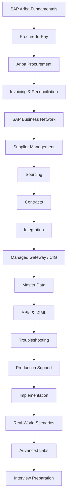

---

# 📚 Repository Contents

| # | Area | What it covers |
|---|---|---|
| 01 | SAP Ariba Fundamentals | Products, terminology, architecture, ecosystem |
| 02 | Procure-to-Pay | PR → PO → GR → Invoice → Payment |
| 03 | Ariba Procurement | Buying, Guided Buying, catalogs, approvals, policies |
| 04 | Invoicing | Invoice processing, reconciliation, exceptions, payment |
| 05 | Sourcing | RFI, RFP, RFQ, auctions, awards |
| 06 | Contracts | Contract lifecycle, workspaces, compliance |
| 07 | Supplier Management | Onboarding, registration, qualification, performance |
| 08 | SAP Business Network | Buyer/supplier collaboration and document exchange |
| 09 | Integration | SAP ERP, SAP S/4HANA, APIs, interfaces |
| 10 | CIG / Managed Gateway | Projects, mappings, transformations, monitoring |
| 11 | Master Data | Suppliers, users, materials, plants, company codes, etc. |
| 12 | Integration Documents | PR, PO, GR, ASN, invoice, credit memo |
| 13 | APIs | REST, SOAP, JSON, authentication, examples |
| 14 | Troubleshooting | Errors, debugging, integration failures |
| 15 | Support Runbook | Incidents, severity, RCA, resolution |
| 16 | Implementation | Requirements → design → testing → go-live |
| 17 | Real-World Scenarios | Production-style business and technical cases |
| 18 | Interview Preparation | Functional, technical and scenario questions |
| 19 | Labs | Simulated hands-on exercises |
| 20 | Architecture | End-to-end diagrams and data flows |

---

# 🏗️ SAP Ariba Ecosystem — High-Level View

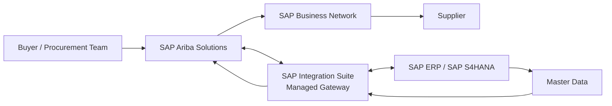

### Core idea

SAP Ariba solutions support procurement and spend-management processes, while SAP Business Network provides collaboration and transaction exchange between buyers and suppliers. SAP describes the Business Network as the successor/current name for Ariba Network.  
Reference: [SAP Business Network](https://www.sap.com/products/spend-management/ariba-network.html)

---

# 🔄 End-to-End Procure-to-Pay

The central process covered in this repository is:

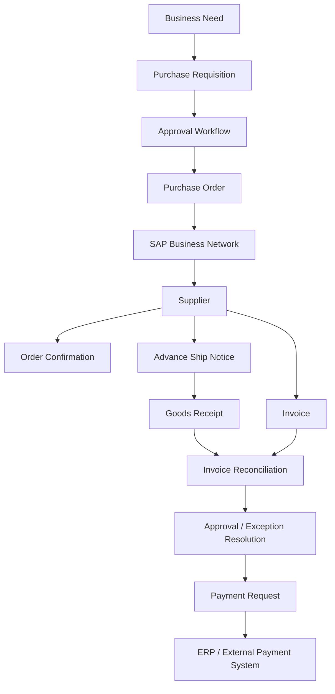

## P2P topics

- Purchase requisition
- Catalog and non-catalog purchasing
- Approval workflow
- Purchase order
- Order confirmation
- Ship notice / ASN
- Goods receipt
- Service receipt / service sheet
- Invoice
- Invoice reconciliation
- 2-way / 3-way matching concepts
- Exceptions
- Credit memos
- Payment request
- ERP integration
- Reporting and financial data

SAP's current purchasing documentation describes purchase requisitions as approvable procurement requests and covers requisitions, aggregated requisitions, purchase orders, accounting, and receiving.

Reference: [SAP Help — Purchasing Guide](https://help.sap.com/docs/buying-invoicing/purchasing-guide-for-procurement-professionals/purchasing-guide-for-procurement-professionals)

---

# 🛒 Procurement

## Topics

### Buying

- Requisition creation
- Catalog buying
- Non-catalog buying
- Forms
- Punchout concepts
- Shopping cart concepts
- Approval flows
- Purchasing policies
- Accounting information
- Receiving

### Guided Buying

- User experience
- Buying channels
- Policies
- Forms
- Preferred suppliers
- Catalogs
- Procurement guidance
- Request flows

### Catalogs

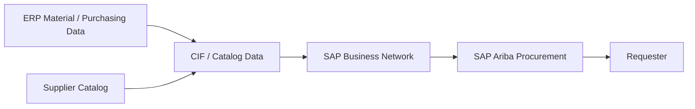

Catalogs describe products/services offered by suppliers and can be integrated into procurement solutions.

Reference: [SAP Help — Integrate Catalogs](https://help.sap.com/docs/sisgw/sap-ariba-cloud-integration-gateway-overview-guide/integrating-catalogs)

---

# 🧾 Invoicing & Invoice Reconciliation

## Coverage

- Invoice creation
- PO-based invoice
- Non-PO invoice
- Contract invoice
- Credit memo
- Invoice status
- Invoice exceptions
- Invoice reconciliation
- Tolerance concepts
- Matching
- Approval
- Payment request
- ERP export
- Payment integration

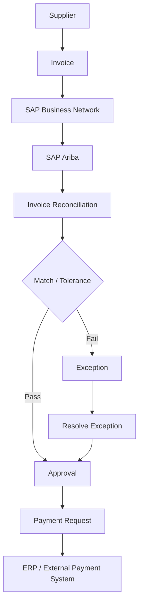

SAP's current invoicing documentation covers invoice processing and payment workflows for SAP Ariba Buying and Invoicing, Invoice Management, and Contract Invoicing.

Reference: [SAP Help — Invoicing and Payment Process Guide](https://help.sap.com/docs/buying-invoicing/invoicing-and-payment-process-guide/)

---

# 🌐 SAP Business Network

> **Formerly widely known as Ariba Network.**

The network connects buyers and suppliers for electronic business collaboration and document exchange.

## Documents and interactions

- Purchase orders
- Order confirmations
- Ship notices
- Invoices
- Credit memos
- Catalogs
- Contracts
- Sourcing events
- Supplier collaboration

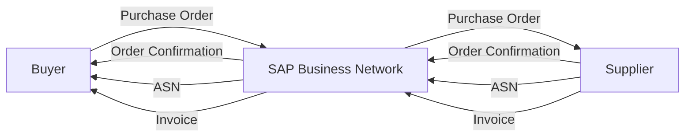

Reference: [SAP — SAP Business Network](https://www.sap.com/products/spend-management/ariba-network.html)

---

# 🧑‍💼 Supplier Management

## Topics

- Supplier request
- Supplier registration
- Supplier onboarding
- Supplier qualification
- Questionnaires
- Approvals
- Supplier lifecycle
- Supplier performance
- Supplier risk
- Supplier master data
- ERP integration

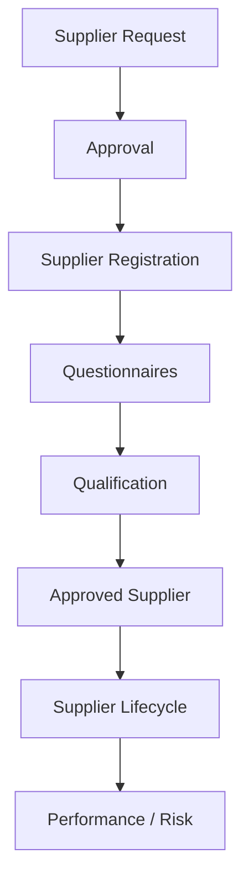

SAP's current supplier-management documentation covers supplier information, onboarding, registration, lifecycle management, qualification, performance and risk-related processes.

Reference: [SAP Help — Supplier Management](https://help.sap.com/docs/portfolio-category/SUPPLIER_MANAGEMENT)

---

# 🔎 SAP Ariba Sourcing

## Topics

- Sourcing projects
- RFI
- RFP
- RFQ
- Auctions
- Supplier participation
- Bid evaluation
- Award scenarios
- Negotiation
- Sourcing-to-contract
- Contract creation

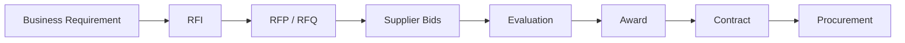

---

# 📑 SAP Ariba Contracts

## Topics

- Contract workspace
- Contract requests
- Authoring
- Approval
- Negotiation
- Contract terms
- Supplier collaboration
- Contract compliance
- Release orders
- ERP integration
- Contract lifecycle

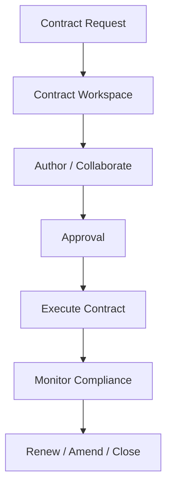

SAP documents integration scenarios in which contract information can be sent from SAP Ariba Contracts to an ERP through SAP Business Network.

Reference: [SAP Help — Contracts / cXML Solutions](https://help.sap.com/docs/ARIBA_NETWORK/cxml-solutions/contracts)

---

# 🔌 Integration Architecture

A major section of this repository focuses on understanding **how SAP Ariba communicates with SAP backend systems**.

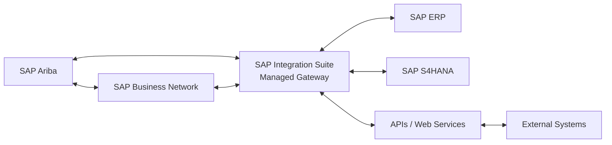

## Integration topics

- SAP ERP integration
- SAP S/4HANA integration
- SAP Business Network integration
- Managed Gateway
- cXML
- SOAP
- REST
- APIs
- Master data replication
- Transaction data
- Catalog integration
- Supplier integration
- Monitoring
- Error handling
- Reprocessing
- Mapping
- Transformation
- Connectivity

Reference: [SAP Help — Ariba Network Integration for SAP ERP](https://help.sap.com/docs/ARIBA_NETWORK_INTEGRATION_FOR_SAP_BUSINESS_SUITE/d92cd678a16b419eba9d49ff03554522/index.html)

---

# 🔧 CIG / SAP Integration Suite, Managed Gateway

> **CIG is a commonly used historical/industry term. Current SAP documentation uses SAP Integration Suite, managed gateway for spend management and SAP Business Network.**

## Coverage

```text
10-CIG/
├── 01-Overview.md
├── 02-Architecture.md
├── 03-Projects.md
├── 04-Connections.md
├── 05-Mappings.md
├── 06-Transformations.md
├── 07-Master-Data.md
├── 08-Transaction-Data.md
├── 09-Monitoring.md
├── 10-Errors.md
├── 11-Reprocessing.md
└── 12-Troubleshooting.md
```

## Typical integration flow

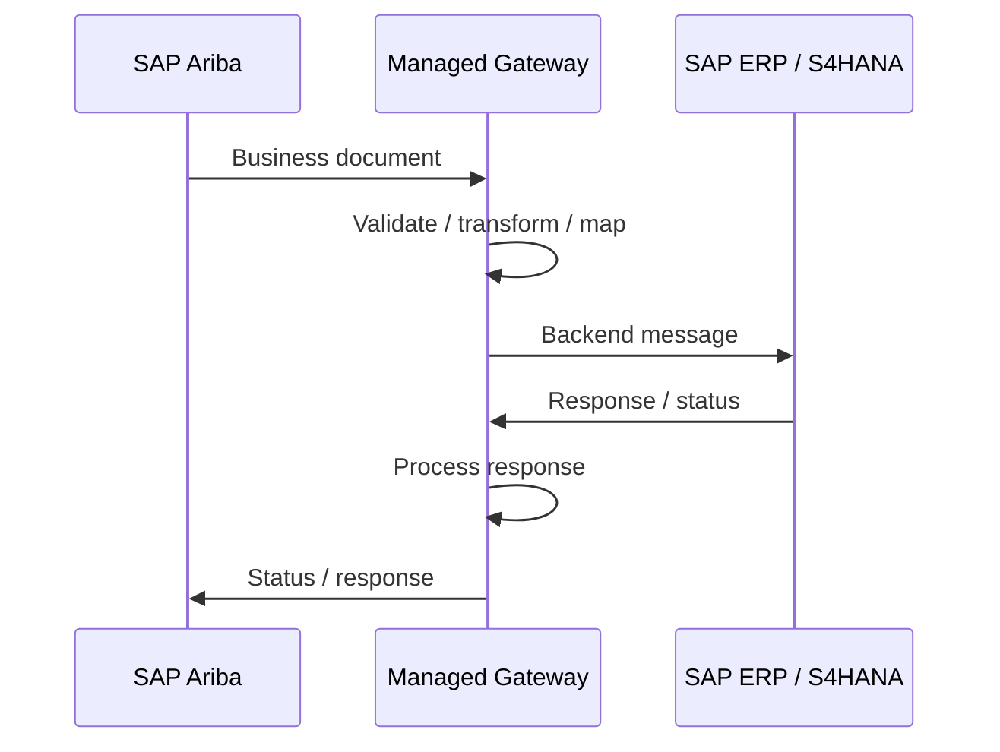

## Important concepts

- Integration projects
- Connections
- Authentication
- Endpoints
- Mapping
- Transformation
- Message monitoring
- Document status
- Error messages
- Reprocessing
- Master data integration
- Transaction integration

Reference: [SAP Help — Managed Gateway overview](https://help.sap.com/docs/sisgw/sap-ariba-cloud-integration-gateway-overview-guide/)

---

# 🗃️ Master Data

Master data is foundational to successful procurement and integration.

## Topics

- Supplier / vendor
- User
- Material
- Plant
- Company code
- Purchasing organization
- Purchasing group
- Cost center
- General ledger account
- Payment terms
- Currency
- Unit of measure
- Commodity
- Tax data
- Accounting data

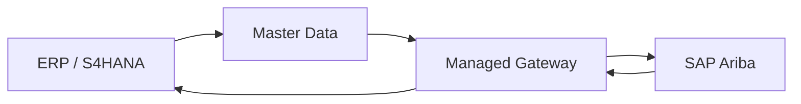

SAP documentation describes master-data integration between SAP systems and SAP Ariba applications, including full-load and incremental-change scenarios.

Reference: [SAP Help — Master Data Replication](https://help.sap.com/docs/ARIBA_PROCUREMENT/9bb842e640154cdeb584e51430986250/master-data-replication-using-sap-master-data-integration-for-sap-ariba-applications)

---

# 📦 Transaction Documents

The repository will document the lifecycle and integration of:

| Document | Purpose |
|---|---|
| PR | Purchase request |
| PO | Purchase order |
| OC | Order confirmation |
| ASN | Advance ship notice |
| GR | Goods receipt |
| SES / Service Sheet | Service confirmation |
| Invoice | Supplier billing |
| Credit Memo | Invoice adjustment / credit |
| Payment Request | Payment-processing representation |

For each document, the repository will cover:

```text
Business purpose
       ↓
Creation
       ↓
Approval
       ↓
Transmission
       ↓
Integration
       ↓
Status
       ↓
Common errors
       ↓
Troubleshooting
       ↓
Reprocessing
```

---

# 🔗 APIs, cXML & Web Services

## API fundamentals

- HTTP
- GET / POST / PUT / PATCH / DELETE
- Headers
- Authentication
- Authorization
- JSON
- XML
- REST
- SOAP
- Status codes
- Request/response
- Error handling
- Idempotency concepts

## cXML

The repository will explain:

- cXML purpose
- Document structure
- Headers
- Payload
- Buyer/supplier interactions
- PO
- Invoice
- Order confirmation
- Ship notice
- Contract-related messages
- Integration troubleshooting

SAP Learning describes SAP Business Network integration as using electronic document exchange, including cXML for buyer/supplier collaboration.

Reference: [SAP Learning — Discovering Ariba Network Integrations](https://learning.sap.com/courses/sap-ariba-integration-sap-ariba-integration-points/discovering-ariba-network-integrations)

---

# 🧪 Troubleshooting Framework

Production support should not be:

> "Check the error and try again."

Use a repeatable investigation model.

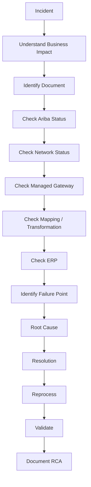

## Troubleshooting categories

### Ariba

- Document stuck
- Approval issue
- Incorrect accounting
- Catalog problem
- Supplier issue
- Invoice exception

### Business Network

- Supplier connectivity
- Trading relationship
- Document delivery
- PO/invoice exchange

### Integration

- Mapping error
- Transformation error
- Authentication
- Connectivity
- Invalid payload
- Missing field
- Master-data mismatch
- Backend rejection

### ERP

- Vendor/material issue
- Company-code issue
- Purchasing-organization issue
- Accounting issue
- Tax issue
- Document validation failure

---

# 🚨 Support Runbook

Every production incident can be documented using:

```markdown
## Incident

### Business Impact

### Severity

### Symptoms

### Document / Transaction

### Initial Checks

### Investigation

### Root Cause

### Resolution

### Validation

### Reprocessing

### Preventive Action

### Lessons Learned
```

## Severity model

```text
P1 → Critical business impact
P2 → Major business impact
P3 → Limited business impact
P4 → Minor / informational
```

> Severity definitions should always follow the organization's actual support SLA rather than blindly applying a generic matrix.

---

# 🏭 Implementation Lifecycle

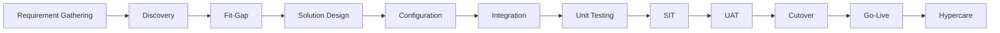

## Implementation topics

- Requirement gathering
- Stakeholder analysis
- Process discovery
- Fit-gap analysis
- Solution design
- Configuration
- Integration design
- Security
- Testing
- SIT
- UAT
- Data migration
- Cutover
- Go-live
- Hypercare
- Support handover

---

# 🧩 Real-World Scenarios

This section converts theory into practical problem solving.

## Scenario 1 — PO not reaching ERP

```text
User creates PO
      ↓
PO approved
      ↓
PO sent to Business Network
      ↓
Integration fails
      ↓
Investigate gateway
      ↓
Check mapping
      ↓
Check ERP response
      ↓
Identify root cause
      ↓
Fix
      ↓
Reprocess
      ↓
Validate PO
```

## Scenario 2 — Invoice exception

```text
Invoice received
      ↓
Invoice reconciliation
      ↓
Mismatch
      ↓
Identify mismatch
      ↓
PO / receipt / invoice comparison
      ↓
Business resolution
      ↓
Approve
      ↓
Payment process
```

## Scenario 3 — Supplier onboarding

```text
Supplier Request
      ↓
Approval
      ↓
Registration
      ↓
Questionnaire
      ↓
Qualification
      ↓
Approval
      ↓
Supplier master integration
      ↓
Supplier available for procurement
```

---

# 🧪 Practical Labs

The repository will contain simulation-based labs that can be performed without access to a production SAP Ariba tenant.

## Lab 01 — End-to-End P2P

Design and document:

```text
Requirement
→ PR
→ Approval
→ PO
→ Supplier
→ Confirmation
→ Receipt
→ Invoice
→ Reconciliation
→ Payment
```

## Lab 02 — Approval Workflow

Create a hypothetical approval matrix based on:

- Amount
- Cost center
- Commodity
- Department
- Requester

## Lab 03 — Catalog

Design a supplier catalog containing:

- Supplier
- Product
- SKU
- Description
- Unit
- Price
- Currency
- Category

## Lab 04 — Invoice Reconciliation

Given:

```text
PO quantity       = 100
Received quantity = 90
Invoiced quantity = 100
```

Investigate the resulting business problem and propose a resolution.

## Lab 05 — Integration Failure

Given a failed PO message:

```text
Document → PO
Status   → Failed
Error    → Missing required backend field
```

Create an RCA and remediation plan.

## Lab 06 — Supplier Replication

Document a supplier lifecycle from Ariba request through registration and ERP replication.

---

# 🏛️ Architecture Repository

The architecture section will include diagrams for:

- P2P
- Ariba Procurement
- SAP Business Network
- Supplier Management
- Sourcing
- Contracts
- ERP integration
- Managed Gateway
- Master-data flow
- Transaction-data flow
- Error flow
- Monitoring
- Support model

---

# 📊 Data Flow — Master vs Transaction

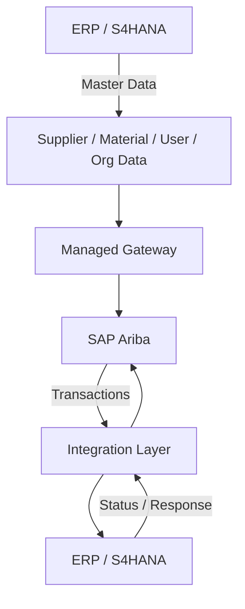

---

# 🔍 Interview Preparation

## Beginner

- What is SAP Ariba?
- What is Procure-to-Pay?
- What is SAP Business Network?
- What is a purchase requisition?
- What is a purchase order?
- What is invoice reconciliation?
- What is Guided Buying?
- What is a catalog?

## Intermediate

- Explain the end-to-end P2P process.
- Explain PO integration.
- Explain invoice processing.
- Explain supplier onboarding.
- Explain master-data integration.
- What is cXML?
- What is CIG / Managed Gateway?
- How do you troubleshoot an integration failure?

## Advanced

- Explain an Ariba–ERP integration architecture.
- How would you investigate a PO stuck in integration?
- How would you distinguish a mapping issue from an ERP rejection?
- How would you troubleshoot a supplier replication failure?
- How would you design an integration monitoring process?
- How would you perform RCA for recurring integration failures?
- What happens when master data is inconsistent between systems?
- How would you design a production-support runbook?

## Scenario-Based

Every scenario should be answered using:

```text
Understand
→ Isolate
→ Investigate
→ Identify Root Cause
→ Resolve
→ Reprocess
→ Validate
→ Prevent Recurrence
```

---

# 📝 Documentation Standard

Every topic in this repository should preferably follow this structure:

```markdown
# Topic

## 1. Definition

## 2. Business Purpose

## 3. Where It Fits

## 4. End-to-End Flow

## 5. Configuration / Design Concepts

## 6. Integration

## 7. Important Data

## 8. Common Errors

## 9. Troubleshooting

## 10. Real-World Scenario

## 11. Interview Questions

## 12. Key Takeaways

## References
```

This keeps the repository consistent and prevents it from becoming an unstructured notes dump.

---

# 🗂️ Planned Repository Structure

```text
SAP-Ariba-Complete-Guide/
│
├── README.md
│
├── 01-SAP-Ariba-Fundamentals/
│   ├── What-is-SAP-Ariba.md
│   ├── Ariba-Solutions.md
│   ├── SAP-Business-Network.md
│   └── Terminology.md
│
├── 02-Procure-to-Pay/
│   ├── P2P-Overview.md
│   ├── Purchase-Requisition.md
│   ├── Purchase-Order.md
│   ├── Goods-Receipt.md
│   ├── Invoice.md
│   └── Payment.md
│
├── 03-Ariba-Procurement/
├── 04-Ariba-Invoicing/
├── 05-Ariba-Sourcing/
├── 06-Ariba-Contracts/
├── 07-Supplier-Management/
├── 08-SAP-Business-Network/
├── 09-Integration/
├── 10-CIG-Managed-Gateway/
├── 11-Master-Data/
├── 12-Integration-Documents/
├── 13-APIs/
├── 14-Troubleshooting/
├── 15-Support-Runbook/
├── 16-Implementation/
├── 17-Real-World-Scenarios/
├── 18-Interview-Preparation/
├── 19-Labs/
├── 20-Architecture/
│
├── diagrams/
│   ├── p2p/
│   ├── integration/
│   ├── business-network/
│   └── supplier-management/
│
├── sample-data/
│   ├── suppliers/
│   ├── purchase-orders/
│   ├── invoices/
│   └── master-data/
│
└── interview-cheatsheets/
```

---

# 🔐 Security & Data-Safety Rules

This repository should contain **sanitized educational material only**.

Never commit:

- Customer names
- Vendor/supplier confidential information
- Internal URLs
- Production screenshots
- Credentials
- API keys
- Tokens
- Certificates
- Private business data
- Internal incident IDs
- Proprietary SAP documentation

Use fictional examples such as:

```text
Buyer: Demo Manufacturing Ltd.
Supplier: Example Components Pvt. Ltd.
ERP: DEMO-S4
Company Code: 1000
Plant: 1100
```

---

# 🧠 How to Use This Repository

### Beginner

Start here:

```text
Fundamentals
↓
P2P
↓
Procurement
↓
Invoicing
```

### Functional Consultant

```text
P2P
↓
Buying
↓
Approvals
↓
Catalogs
↓
Invoicing
↓
Sourcing
↓
Contracts
```

### Integration / Support Engineer

```text
P2P
↓
Business Network
↓
Integration
↓
Managed Gateway / CIG
↓
Master Data
↓
cXML
↓
Troubleshooting
↓
Support Runbook
```

### Interview Preparation

```text
Concepts
↓
Architecture
↓
Real-world scenarios
↓
Troubleshooting
↓
Labs
↓
Interview questions
```

---

# 📚 Official Reference Library

Use official SAP documentation as the primary reference source.

### SAP Ariba

- [SAP Ariba — SAP Learning](https://learning.sap.com/products/intelligent-spend-management/ariba)
- [SAP Ariba — SAP](https://www.sap.com/products/spend-management.html)

### SAP Business Network

- [SAP Business Network](https://www.sap.com/products/spend-management/ariba-network.html)
- [SAP Business Network — Supplier Portal](https://www.sap.com/about/agreements/sap-supplier-portal/ariba.html)

### Procurement

- [Purchasing Guide for Procurement Professionals](https://help.sap.com/docs/buying-invoicing/purchasing-guide-for-procurement-professionals/purchasing-guide-for-procurement-professionals)
- [SAP Ariba Procurement Documentation](https://help.sap.com/docs/ARIBA_PROCUREMENT)

### Invoicing

- [Invoicing and Payment Process Guide](https://help.sap.com/docs/buying-invoicing/invoicing-and-payment-process-guide/)
- [SAP Business Network Guide to Invoicing](https://help.sap.com/docs/ARIBA_PROCUREMENT/ea033fc809c6437d872a5885f25d52d1/sap-business-network-guide-to-invoicing)

### Supplier Management

- [SAP Supplier Management Documentation](https://help.sap.com/docs/portfolio-category/SUPPLIER_MANAGEMENT)
- [Managing Suppliers and Supplier Lifecycles](https://help.sap.com/docs/strategic-sourcing/managing-suppliers-and-supplier-lifecycles/managing-suppliers-and-supplier-lifecycles)

### Integration / Managed Gateway

- [Managed Gateway Overview](https://help.sap.com/docs/sisgw/sap-ariba-cloud-integration-gateway-overview-guide/)
- [Ariba Network Integration for SAP ERP](https://help.sap.com/docs/ARIBA_NETWORK_INTEGRATION_FOR_SAP_BUSINESS_SUITE/d92cd678a16b419eba9d49ff03554522/index.html)
- [Discovering Ariba Network Integrations — SAP Learning](https://learning.sap.com/courses/sap-ariba-integration-sap-ariba-integration-points/discovering-ariba-network-integrations)

### Master Data

- [Master Data Replication for SAP Ariba](https://help.sap.com/docs/ARIBA_PROCUREMENT/9bb842e640154cdeb584e51430986250/master-data-replication-using-sap-master-data-integration-for-sap-ariba-applications)
- [Supplier Data Integration with SAP Systems](https://help.sap.com/docs/strategic-sourcing/supplier-management-setup-and-administration/managing-supplier-data-integration-with-sap-systems)

### Contracts

- [SAP Ariba Contracts / cXML Solutions](https://help.sap.com/docs/ARIBA_NETWORK/cxml-solutions/contracts)

---

# 🛠️ Recommended Tools

| Tool | Purpose |
|---|---|
| Git / GitHub | Version control and collaboration |
| VS Code | Documentation and development |
| Mermaid | Architecture and process diagrams |
| Draw.io | Detailed architecture diagrams |
| Postman | API experimentation |
| JSON / XML tools | Payload inspection |
| Markdown | Documentation |
| Excel / CSV | Sample business data |
| Python | Optional automation and data analysis |

---

# 🚀 Future Enhancements

Possible additions as the repository grows:

- [ ] Complete P2P process documentation
- [ ] Complete CIG / Managed Gateway guide
- [ ] cXML examples using fictional data
- [ ] API examples
- [ ] Integration payload examples
- [ ] Error-code reference
- [ ] Troubleshooting decision trees
- [ ] Architecture diagrams
- [ ] Support templates
- [ ] RCA templates
- [ ] Mock production incidents
- [ ] Interview question bank
- [ ] Scenario-based interview answers
- [ ] Hands-on labs
- [ ] Sample master data
- [ ] Sample PO / invoice data
- [ ] Postman collection
- [ ] Python utilities for sample data
- [ ] GitHub Actions for Markdown/link validation
- [ ] Automated documentation checks

---

# 🎯 Repository Goal

The objective is to build a **single, structured, continuously evolving SAP Ariba reference repository** that connects:

```text
Business Process
       +
SAP Ariba Functional Concepts
       +
SAP Business Network
       +
ERP Integration
       +
Managed Gateway / CIG
       +
Master Data
       +
Transaction Data
       +
APIs / cXML
       +
Troubleshooting
       +
Production Support
       +
Implementation
       +
Hands-on Labs
       +
Interview Preparation
```

The repository is intended to demonstrate not only **what SAP Ariba features do**, but also **how business processes, integrations, data, failures, troubleshooting, and support fit together**.

---

## ⚠️ Disclaimer

This is an independent educational repository and is not affiliated with, sponsored by, or endorsed by SAP SE.

SAP, SAP Ariba, SAP Business Network, SAP S/4HANA and related names are trademarks of SAP SE or its affiliates.

All examples in this repository should use fictional or sanitized data. Official SAP documentation should be consulted for product-specific configuration, supported releases, security requirements, and current implementation guidance.

---

## 👨‍💻 Author

**Prateek**

GitHub: [@Ram-2200](https://github.com/Ram-2200)

---

## ⭐ Contribution / Feedback

This repository is intended to evolve over time.

If you identify an outdated concept, broken reference, missing topic, or useful scenario, improvements can be proposed through GitHub issues or pull requests.

---

**Built as a practical learning, reference, and interview-preparation repository for SAP Ariba and procurement integration.**
